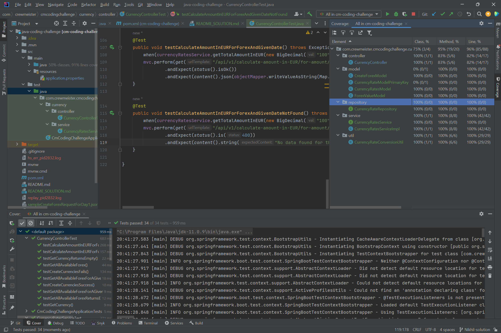
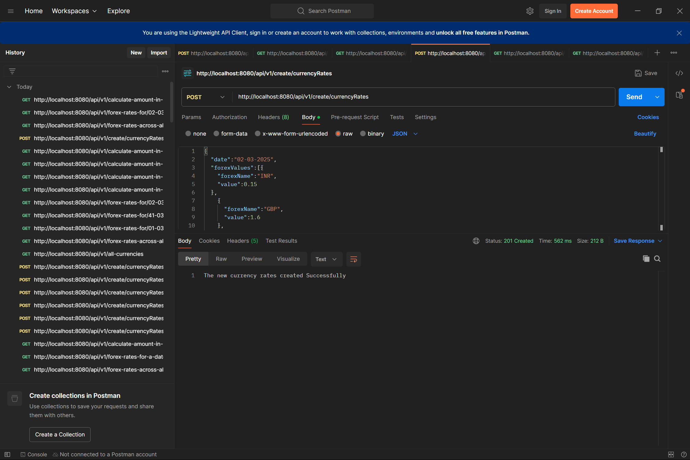
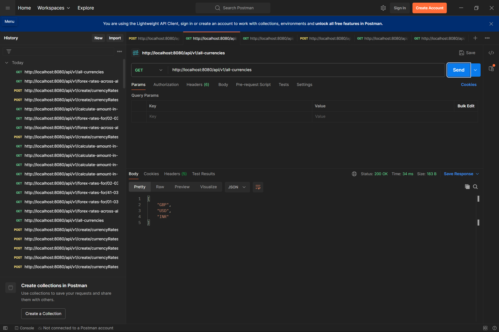
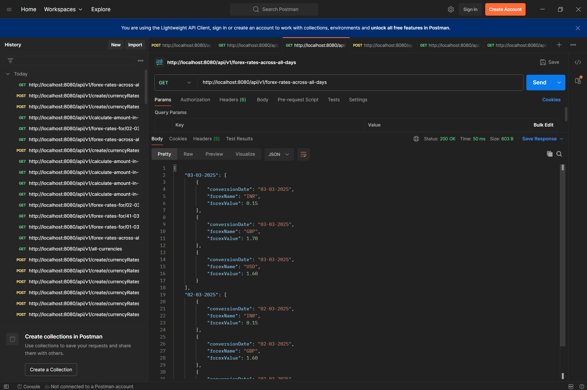
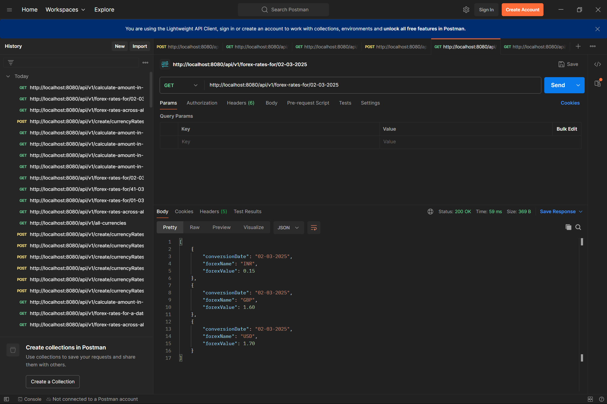
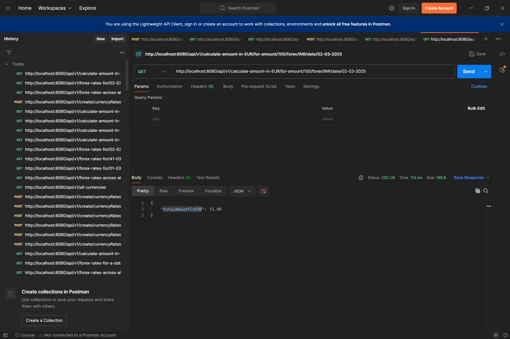

# Crewmeister Test Assignment - Java Backend Developer- Solution

## Setup
1. Added H2 Database dependency in pom and the Hibernate configurations in application.properties.
2. Added jpa, lombok dependency for implementation of solution.
3. For writing test cases added Mockito and Spring boot starter test dependency in pom.

## Implementation Details

H2 Database has been used for storing the data

An end point has been provided to load the data  `api/v1/create/currencyRates`
- The sample Json is attached for loading the data  sampleCreateForexRequestForDay1.json and sampleCreateForexRequestForDay2.json

The user Stories are covered in the following end points
- User Story 1 end point `api/v1/all-currencies`
- User Story 2 end point `/api/v1/forex-rates-across-all-days`
- User Story 3 end point `/api/v1/forex-rates-for/{conversionDate}`
- User Story 4 end point `/api/v1/calculate-amount-in-EUR/for-amount/{amount}/forex/{forex}/date/{conversionDate}`

All the end point details can be found in the spec.yaml document attached in the project. It includes the request and response of all the APIs.

The forex amount and conversion amount should be greater than 0.

The date should be in dd-MM-yyyy format and all the validations on the date has been added.

For a given day a currency for example INR can be added only once.

Models, Services and utils has been created as per the implementation needs.

Exceptions by DB have been handled at the applicable places in the code.

The DB calls have been added in one method and reused wherever needed.

An interface has been created for all the methods and autowired in controller for extensibility

The already provided controller `api/v1/currencies` and the methods used by it are left untouched.

## Testing through code
1. Controller test cases are written through spring tests and all cases for 5 created controllers are covered.
2. Unit test cases are written for services covering all the edge cases and main cases. Even here 100% coverage is achieved.

## Self Testing
All the cases have been tested but to keep the document short attaching only the happy cases testing screenshots.
1. Post the currency

2. User Story 1 `api/v1/all-currencies`

3. User Story 2 `/api/v1/forex-rates-across-all-days`

4. User Story 3 `/api/v1/forex-rates-for/{conversionDate}`

5. User Story 4 `/api/v1/calculate-amount-in-EUR/for-amount/{amount}/forex/{forex}/date/{conversionDate}`

## Future Enhancements
- Extend the APIs to accept other date format
- Add authentication to the APIs
- Clean up the unused code provided at the time of setup
- Optimize the database query and fetch from the DB once and keep it in application memory in instance variable. Populate the instance variable the first time and for subsequent queries access from there. In case of new Forex addition clear the variable and follow same process in the next query.
- Combine the APIs of user Story 2 and user Story 3 by taking the conversion date as query param and return the response based on date if query parameter is present else written all the available data.
